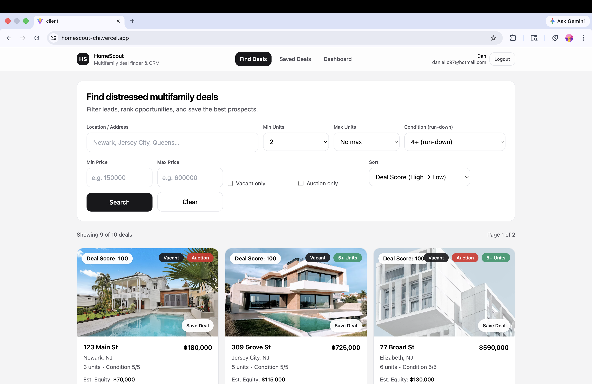
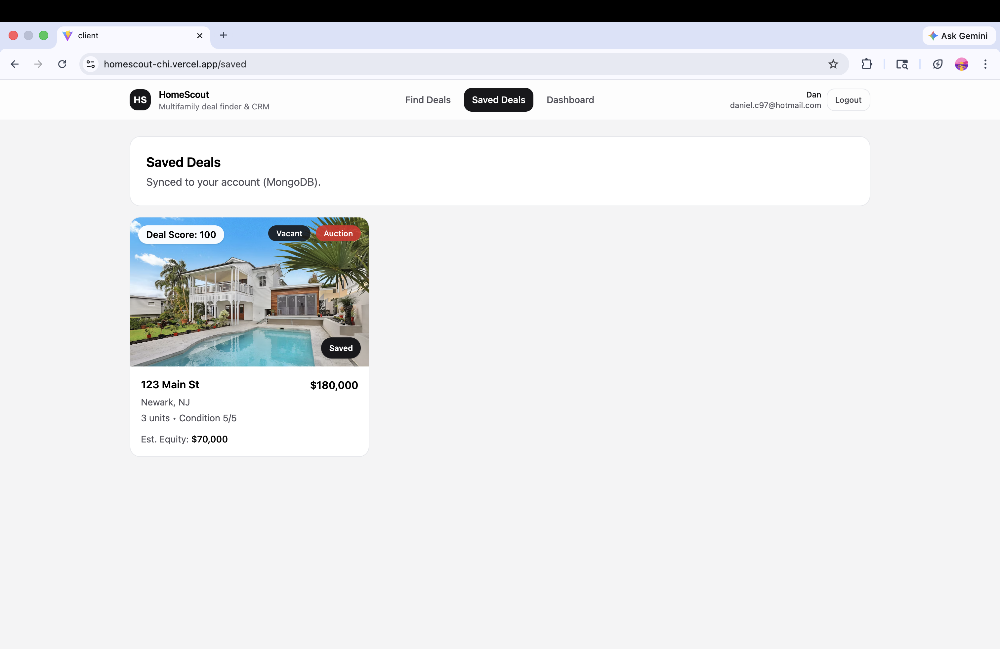

# HomeScout

HomeScout is a full-stack web application that helps real estate investors identify distressed multifamily properties with strong investment potential.

The platform allows users to search and filter properties, analyze potential deals using a scoring system, and save opportunities while tracking notes and status.

This project demonstrates full-stack engineering skills including frontend development, backend API design, authentication, database persistence, and production deployment.

---

# Live Demo

Frontend  
https://homescout-chi.vercel.app

Backend API  
https://homescout-kd7t.onrender.com

---

# Screenshots

## Property Search


## Filters


## Property Results


## Saved Deals


---

# Features

## Property Discovery
- Search properties by city or address
- Filter by number of units, price range, condition, vacancy, and auction status
- Pagination for browsing multiple pages of results

## Deal Analysis
- Automated deal scoring algorithm
- Equity estimation
- Distressed property targeting

## User Accounts
- Secure authentication
- JWT based login
- httpOnly cookie sessions

## Investor Workflow
- Save promising deals
- Add notes and track deal status
- Review saved opportunities in a dashboard

---

# Tech Stack

## Frontend
React  
Vite  
Tailwind CSS  

## Backend
Node.js  
Express  

## Database
MongoDB Atlas  

## Authentication
JWT  
httpOnly cookies  

## Deployment
Frontend: Vercel  
Backend: Render  
Database: MongoDB Atlas  

---

# Architecture

User Browser  
↓  
React Frontend (Vercel)  
↓  
REST API Requests  
↓  
Node.js / Express Backend (Render)  
↓  
MongoDB Atlas Database

---

# Project Structure

```
homescout
│
├── client
│ ├── src
│ │ ├── components
│ │ ├── pages
│ │ ├── lib
│ │ └── styles
│
├── server
│ ├── models
│ ├── routes
│ ├── auth
│ └── index.js
│
└── README.md

```

# API Endpoints

## Properties

GET /api/properties  
Search and filter property deals.

GET /api/properties/:id  
Retrieve a single property.

---

## Authentication

POST /api/auth/register  
Create a new user account.

POST /api/auth/login  
Login user.

POST /api/auth/logout  
Logout user.

GET /api/auth/me  
Return current authenticated user.

---

## User Deals

POST /api/my/leads/:leadId/save  
Save a property.

DELETE /api/my/leads/:leadId/save  
Remove saved property.

GET /api/my/saved-deals  
Retrieve saved deals.

PUT /api/my/leads/:leadId/meta  
Update notes or status.

---

# Running the Project Locally

Clone the repository

git clone https://github.com/DRC7/homescout  
cd homescout

---

## Install dependencies
Server

cd server  
npm install  

Client

cd ../client  
npm install  

---

## Environment Variables

Create a `.env` file inside `/server`

MONGODB_URI=your_mongodb_connection_string  
JWT_SECRET=your_secret_key  
CLIENT_ORIGIN=http://localhost:5173  

---

## Run the backend

cd server  
npm run dev  

---

## Run the frontend

cd client  
npm run dev  

---

# What This Project Demonstrates

This project highlights important full-stack engineering concepts including:

- REST API design
- secure authentication systems
- database modeling and persistence
- frontend state management
- production deployment and environment configuration
- debugging real production issues such as CORS and API routing

---

# Future Improvements

Possible enhancements include:

- integration with real property data sources
- map based property search
- ROI and cap rate calculations
- investor analytics dashboard
- automated distressed property lead generation

---

# Author

Daniel C

GitHub  
https://github.com/DRC7

---

# License

MIT
