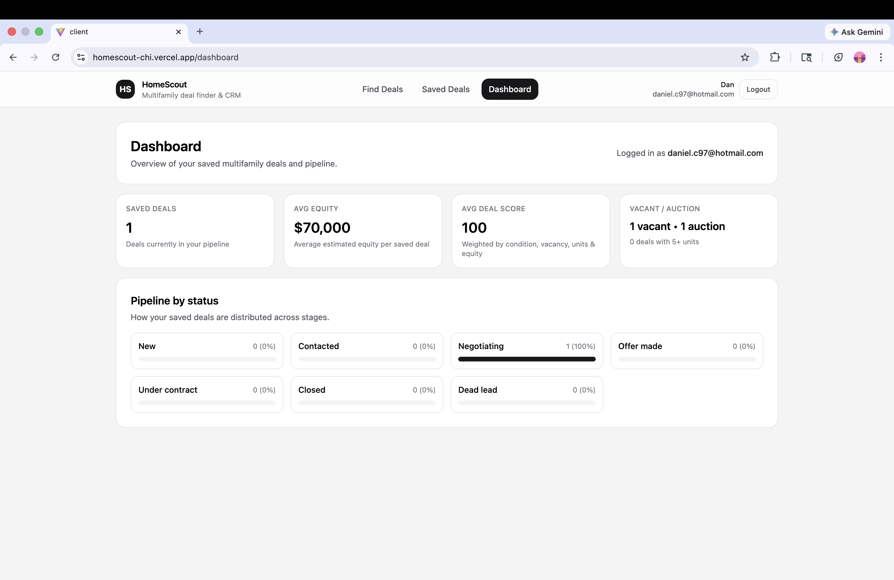

# HomeScout — Full-Stack Multifamily Deal Finder & Investor CRM

HomeScout is a production-deployed MERN application that helps real estate investors identify, evaluate, and manage distressed multifamily property opportunities.

The platform combines **search + filtering**, **deal scoring**, **saved deals**, **CRM-style notes/status tracking**, and **user-specific dashboards** into one workflow-focused product.

This project was built to demonstrate the kind of full-stack engineering used in modern SaaS applications: API design, authentication, database modeling, production deployment, and frontend/backend integration.

---

## Live Demo

**Frontend:** [https://homescout-chi.vercel.app](https://homescout-chi.vercel.app)

**Backend API:** [https://homescout-kd7t.onrender.com/api/health](https://homescout-kd7t.onrender.com/api/health)

**GitHub:** [https://github.com/DRC7/homescout](https://github.com/DRC7/homescout)

> Note: the backend is an API service hosted on Render, so visiting the root backend URL may show `Cannot GET /`. The health endpoint above confirms the API is online.

---

## Why This Project Matters

HomeScout is more than a CRUD demo. It shows the ability to:

* build a complete full-stack product from frontend to database
* design secure authentication with JWT + httpOnly cookies
* create API-driven filtering, sorting, and pagination
* manage per-user saved items and metadata in MongoDB
* debug real deployment issues such as CORS, environment variables, and production API routing
* ship a working application to the public internet

---

## Features

### Authentication & User Sessions

* Secure registration and login
* JWT authentication stored in **httpOnly cookies**
* Protected user-specific routes
* Persistent account-based saved deals and CRM metadata

### Multifamily Deal Search

* Search by address or city
* Filter by:

  * min/max units
  * min/max price
  * condition score
  * vacancy
  * auction status
* Paginated results
* Sorting by:

  * deal score
  * equity
  * asking price

### Deal Analysis

* Automated deal scoring algorithm
* Estimated equity display
* Distressed property targeting
* Investment-focused listing presentation

### Saved Deals + Investor Workflow

* Save and unsave deals per authenticated user
* Track deal notes and status
* CRM-style workflow for managing opportunities

### Dashboard Analytics

* Total saved deals
* Average deal score
* Average estimated equity
* Vacant and auction counts
* 5+ unit property count
* Status breakdown across the deal pipeline

---

## Screenshots

### Search Results


### Saved Deals


### Dashboard



---

## Tech Stack

### Frontend

* React
* Vite
* React Router
* Tailwind CSS
* Context API
* Reusable API helper layer

### Backend

* Node.js
* Express
* Mongoose
* CORS + cookie-parser
* JWT authentication

### Database

* MongoDB Atlas

### Deployment

* Frontend: Vercel
* Backend: Render
* Database: MongoDB Atlas

---

## Architecture

```text
Browser
  ↓
React Frontend (Vercel)
  ↓
Fetch requests with credentials
  ↓
Express API (Render)
  ↓
MongoDB Atlas
```

### Core Data Models

* **User** — account credentials and identity
* **Lead** — multifamily property/deal record
* **UserLeadMeta** — per-user saved state, notes, and status

---

## Project Structure

```text
homescout/
├── client/
│   ├── public/
│   ├── src/
│   │   ├── components/
│   │   ├── context/
│   │   ├── lib/
│   │   ├── pages/
│   │   ├── App.jsx
│   │   └── main.jsx
│   ├── index.html
│   └── package.json
├── server/
│   ├── models/
│   ├── auth.js
│   ├── db.js
│   ├── index.js
│   ├── seed.js
│   └── package.json
├── screenshots/
└── README.md
```

---

## API Overview

### Auth

| Method | Endpoint             | Purpose                           |
| ------ | -------------------- | --------------------------------- |
| POST   | `/api/auth/register` | Create a new user                 |
| POST   | `/api/auth/login`    | Log in                            |
| POST   | `/api/auth/logout`   | Log out                           |
| GET    | `/api/auth/me`       | Return current authenticated user |

### Properties / Deals

| Method | Endpoint              | Purpose                              |
| ------ | --------------------- | ------------------------------------ |
| GET    | `/api/properties`     | Search, filter, sort, paginate deals |
| GET    | `/api/properties/:id` | Fetch single deal details            |

### User Deal Actions

| Method | Endpoint                 | Purpose                                 |
| ------ | ------------------------ | --------------------------------------- |
| GET    | `/api/my/saved-deals`    | Return saved deals for the current user |
| POST   | `/api/my/leads/:id/save` | Save a deal                             |
| DELETE | `/api/my/leads/:id/save` | Unsave a deal                           |
| GET    | `/api/my/leads/:id/meta` | Get notes/status for a deal             |
| PUT    | `/api/my/leads/:id/meta` | Update notes/status for a deal          |

---

## Local Development

### 1. Clone the repository

```bash
git clone https://github.com/DRC7/homescout.git
cd homescout
```

### 2. Install dependencies

```bash
cd server
npm install
cd ../client
npm install
```

### 3. Configure environment variables

Create `server/.env`:

```env
MONGODB_URI=your_mongodb_connection_string
JWT_SECRET=your_long_random_secret
PORT=5050
CLIENT_ORIGIN=http://localhost:5173
```

Create `client/.env`:

```env
VITE_API_BASE_URL=http://localhost:5050
```

### 4. Seed the database

```bash
cd server
node seed.js
```

### 5. Start the backend

```bash
cd server
npm run dev
```

### 6. Start the frontend

```bash
cd client
npm run dev
```

Frontend runs at **[http://localhost:5173](http://localhost:5173)**.

---

## Production Deployment Notes

* Frontend is deployed on Vercel
* Backend is deployed on Render
* MongoDB Atlas stores persistent data
* Production auth uses cookies with cross-origin requests
* Environment variables are required for both frontend and backend

---

## Future Improvements

* map-based property search
* richer deal analytics (ROI, cap rate, rehab estimate)
* email/password reset
* AI-assisted deal analysis
* import/export for investor lead data
* team accounts and collaboration workflows

---

## Contact

**Daniel C**

GitHub: [https://github.com/DRC7](https://github.com/DRC7)

Email: daniel.cuzco@gmail.com

Role Focus: Full-Stack Engineer / Software Engineer

Open to: interviews, take-home projects, and technical screenings
